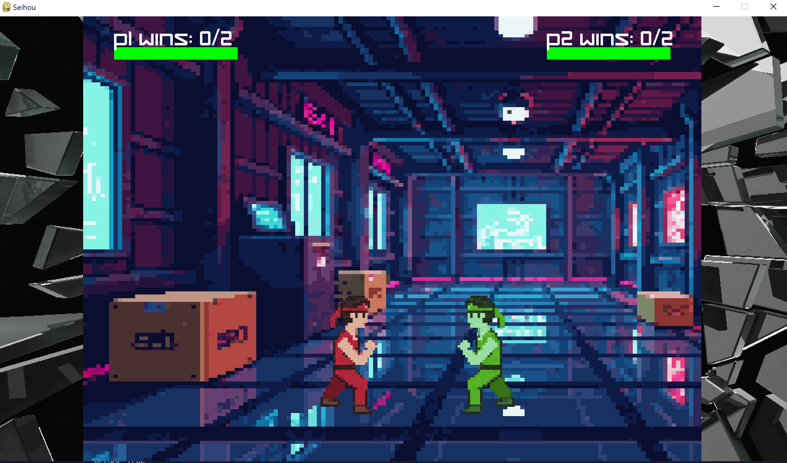

<div align="center">
  
</div>

# Seihou: A simple fighting game

> [!NOTE]
> You gotta have a older version of python e.g. 3.11 otherwise pygame fails to install

# Download
```bash
git clone https://github.com/Typhoonz0/Seihou.git
cd Seihou
pip install -r requirements.txt
```

<div align="center">
  
</div>
